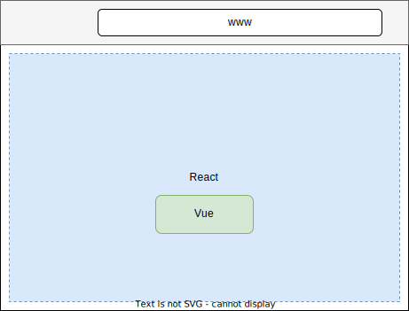

# Micro Frontend example using Vite + Module Federation

Small micro frontend example using [Vite](https://vitejs.dev) and [Module Federation](https://github.com/originjs/vite-plugin-federation). There are two applications: [React](https://react.dev) and [Vue](https://vuejs.org).

## Applications

| Type   | Port | Description            | Url                     |
| ------ | ---- | ---------------------- | ----------------------- |
| Host   | 5000 | The React application. | <http://localhost:5000> |
| Remote | 5001 | The Vue application.   | <http://localhost:5001> |

The goal is to render the Vue `<Counter />` component in the React application.



## Prerequisites

[NodeJS](https://nodejs.org/en)

## Steps

For each applications do:

1. Install dependencies

   ```sh
   npm i
   ```

2. Build the application

   ```sh
   npm run build
   ```

3. Run the local build result

   ```sh
   npm run preview
   ```
